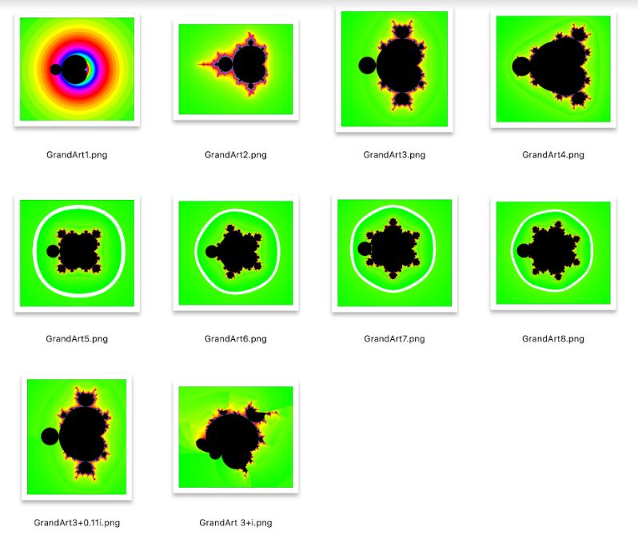

# GrandArt

SwiftUI macOS app to create custom art using variations of the Mandelbrot set.

Go to [Sources/GrandArt/Utilities/ArtInputs.swift](Sources/GrandArt/Utilities/ArtInputs.swift)

And specify the real and imaginary part of the exponent.

- At 2.0 + 0i, you have MandArt (with 2, 4, 8 branches)

- At 3.0 + 0i, you have something similar but odd (5, 7, 15 branches) 

The real part of the exponent will influence the "spreading" of the set, while the imaginary part will introduce a "rotation" or "twist."

- Applied Physics Engineering
- [Bruce Johnson](https://github.com/bruceranger)
- [App Store Connect](https://appstoreconnect.apple.com)
- [Care and Feeding of GrandArt](CARE_AND_FEEDING.md)
